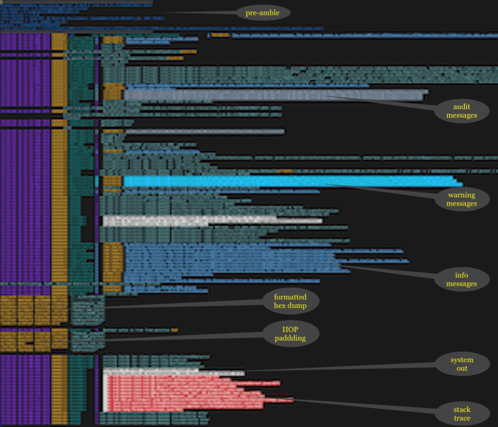

Vim_ syntax highlighting for OpenLiberty_ trace
###############################################

This Vim_ bundle provides syntax highlighting for trace and message logs from OpenLiberty_ and related products. It might look something like this, depending on your Vim `colorscheme` and `background` settings.

Installing
^^^^^^^^^^

Once you have Vundle_ installed, add this plugin to your ``.vimrc``. It should look something like this::

   set nocompatible
   filetype off
   set rtp+=~/.vim/bundle/vundle/
   call vundle#rc()
   Plugin 'gmarik/vundle'
   Plugin 'joe-chacko/vim-open-liberty-trace'
   filetype plugin on
   syntax enable

Then run ``:PluginInstall`` from within Vim_.

This example may be out of date. Please refer to the Vundle_ documentation for the latest information.

.. _OpenLiberty:    https://github.com/OpenLiberty/open-liberty
.. _Vim:            https://www.vim.org
.. _Vundle:         https://github.com/VundleVim/Vundle.vim
